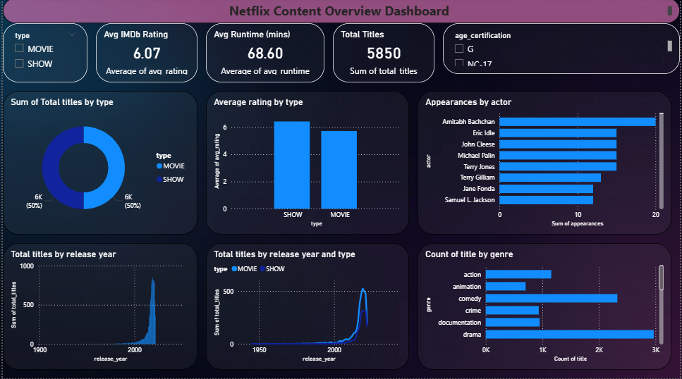

# 🎬 Netflix Data Intelligence Dashboard

## 📌 Problem Statement

Netflix operates in a highly competitive streaming market where content strategy drives user acquisition and retention.
This project analyzes Netflix’s dataset to uncover **content trends, actor influence, and geographical distribution patterns** that can inform strategic decisions.

---

## 🎯 Objective

To transform raw Netflix data into actionable insights using **SQL-driven analysis** and an **interactive Power BI dashboard**.

---

## 🧰 Tech Stack

* **SQL** → Data cleaning, transformation, and analysis
* **Power BI** → Data visualization & dashboarding
* **CSV** → Structured dataset

---

## 📊 Key Analytical Questions

* How has Netflix content evolved over time?
* Which actors appear most frequently, and what does it indicate about casting trends?
* Which countries contribute the most content?
* What patterns exist in content growth and expansion strategy?

---

## 🔍 Key Insights

* 📈 **Content Growth**: Significant increase in content post-2015, indicating aggressive expansion
* 🌍 **Geographical Dominance**: Certain countries dominate content production, reflecting market focus
* 🎭 **Actor Patterns**: Repeated actor appearances suggest strategic casting or audience preference
* 📊 **Trend Shift**: Shift toward diverse/global content over time

---

## 📁 Project Structure

```
├── data/                # Processed datasets
├── sql/                 # SQL scripts for analysis
├── dashboard/           # Power BI dashboard file
```

---

## 🚀 How to Use

1. Execute SQL scripts to understand transformations
2. Load datasets into Power BI
3. Open `.pbix` file to explore dashboard

---

## 📸 Dashboard Preview


---

## 💡 Business Value

This project demonstrates the ability to:

* Translate raw data into strategic insights
* Perform exploratory data analysis using SQL
* Build decision-support dashboards
* Think from a **business + analytics perspective**, not just technical

---

## 🔮 Future Enhancements

* Predictive modeling for content success
* Genre-based recommendation insights
* Integration with real-time streaming data

---
